# Arquitectura y diseño de software actual — Barbería Cale

**Documento técnico de la versión actual**  
**Proyecto:** Barbería Cale  
**Versión del alcance documentado:** 1.0 ampliada  
**Fecha de corte:** 27 de agosto de 2026  
**Propósito académico:** evidencia para la actividad “Diseño de la Arquitectura Inicial del Proyecto”  

> Este documento describe exclusivamente la arquitectura que implementa la versión actual del sistema. No presenta una arquitectura idealizada ni una propuesta de microservicios inexistente. Las referencias a archivos, módulos, contratos, tablas y despliegues corresponden al repositorio actual.

---

## 1. Resumen ejecutivo

Barbería Cale es una solución cliente-servidor para administrar el ciclo completo de una cita de barbería. Ofrece una aplicación construida con Expo y React Native que comparte base de código entre Android y web, una API REST en Express, persistencia PostgreSQL alojada en Supabase y un subsistema asíncrono de recordatorios push. El cliente puede registrarse, iniciar sesión, consultar disponibilidad, reservar, revisar o cancelar citas y confirmar su asistencia. El administrador puede gestionar solicitudes, consultar una agenda, completar el servicio, preparar comunicación por WhatsApp y enviar recordatorios de asistencia individuales o masivos.

La arquitectura principal es **cliente-servidor, organizada por capas y módulos, con una API REST como frontera de negocio**. El backend es un monolito modular: sus rutas, middlewares, controladores y servicios se despliegan como una sola unidad en Render, pero tienen responsabilidades separadas. PostgreSQL es la fuente de verdad para usuarios, citas, dispositivos y trabajos de notificación. El envío programado no depende de que una persona mantenga abierta la aplicación: `pg_cron` activa una Supabase Edge Function mediante `pg_net`; la función reclama trabajo de manera segura mediante RPC restringidas y entrega mensajes a Expo Push, que utiliza FCM para Android.

La elección responde al tamaño actual del proyecto. Mantiene bajo el costo operativo, reutiliza interfaz y dominio entre Android y web, centraliza las reglas sensibles y permite evolucionar cada módulo sin introducir todavía la complejidad operativa de varios servicios independientes.

---

## 2. Objetivo y alcance actual

### 2.1 Objetivo general

Desarrollar una aplicación móvil y web para Barbería Cale que permita gestionar de forma segura, centralizada y trazable el ciclo de una cita, desde el registro e inicio de sesión del cliente y la consulta de disponibilidad hasta la gestión administrativa, la comunicación asistida, los recordatorios de asistencia y el cierre de la cita.

### 2.2 Actores

| Actor | Responsabilidades en la versión actual |
|---|---|
| Cliente (`CLIENT`) | Registrarse, autenticarse, mantener o cerrar la sesión, consultar horarios, reservar, consultar próximas citas e historial, cancelar cuando la regla temporal lo permita, activar recordatorios en un dispositivo y confirmar asistencia. |
| Administrador (`ADMIN`) | Consultar y filtrar solicitudes, aceptar o rechazar citas, consultar agenda, cancelar citas elegibles, completar servicios, abrir WhatsApp con un mensaje preparado, observar la confirmación del cliente y solicitar recordatorios individuales o masivos. |
| Planificador del sistema | Ejecutar cada minuto la búsqueda de recordatorios automáticos y trabajos manuales pendientes. No es un usuario humano; es un actor técnico representado por `pg_cron`. |
| Servicios externos | Render ejecuta la API, Supabase almacena datos y ejecuta el worker, Expo Push/FCM entrega notificaciones Android, Netlify sirve la web, EAS genera el APK y WhatsApp recibe enlaces preparados. |

### 2.3 Funcionalidades incluidas

- Registro de clientes con confirmación de contraseña e inicio automático de sesión.
- Inicio y cierre de sesión con persistencia opcional.
- Autenticación JWT y autorización efectiva por roles `CLIENT` y `ADMIN`.
- Validación de celular de ocho dígitos, sin espacios y con prefijo `8`, `7` o `5`.
- Disponibilidad en bloques de una hora entre las 08:00 y las 17:00.
- Reserva con un mínimo real de 24 horas de anticipación.
- Prevención de doble reserva, máximo de una cita activa del cliente por día y máximo de dos citas activas dentro de cualquier ventana móvil de siete días.
- Consulta paginada de próximas citas e historial.
- Cancelación por el cliente hasta, e incluyendo, exactamente 60 minutos antes del inicio.
- Gestión administrativa por estado, búsqueda, paginación y rango de fechas.
- Estados de cita `PENDING`, `ACCEPTED`, `COMPLETED`, `REJECTED` y `CANCELLED`.
- Confirmación de asistencia del cliente como un dato independiente del estado de la cita.
- Registro y desactivación de dispositivos para notificaciones.
- Recordatorio automático aproximadamente una hora antes de una cita aceptada que aún no tiene confirmación de asistencia.
- Recordatorios administrativos individuales o masivos para citas aceptadas y pendientes de respuesta.
- Comunicación asistida por WhatsApp mediante mensaje contextual preparado para revisión y envío manual.
- Aplicación Android mediante EAS y aplicación web estática mediante Expo/Netlify.

### 2.4 Fuera del alcance actual

- Pagos, facturación, caja o integración bancaria.
- Selección de barbero, múltiples sucursales, inventario o catálogo dinámico de servicios.
- Reprogramación directa de una cita; actualmente se cancela y se crea otra.
- Autenticación social, recuperación automática de contraseña o segundo factor.
- Notificaciones push remotas para web; el flujo implementado se utiliza en compilaciones nativas Android.
- Envío automatizado por la API de WhatsApp. El sistema solo prepara y abre el mensaje.
- Procesamiento sistemático de recibos finales de Expo Push. La versión actual registra aceptación por el servicio de Expo, no prueba de visualización en el dispositivo.
- Panel analítico, reportes financieros o exportaciones.

### 2.5 Restricciones y supuestos

- La zona horaria de negocio autoritativa en el código es `America/Managua`; toda comparación sensible debe utilizarla de forma consistente.
- El servicio ofrecido por la interfaz actual es “Corte de cabello”.
- Las reglas de negocio deben imponerse en el backend y la base de datos, aun cuando el frontend también anticipe validaciones para mejorar la experiencia.
- Una instancia gratuita de Render puede entrar en reposo y añadir latencia al primer llamado.
- Las notificaciones requieren una compilación nativa con la configuración de Firebase; Expo Go no sustituye esa compilación para este caso.
- Ningún secreto de JWT, base de datos, Firebase, Supabase service role o cron debe formar parte del repositorio ni de este documento.

---

## 3. Requisitos funcionales actualizados

Los RF-01 a RF-17 corresponden al alcance funcional base. Los RF-18 a RF-22 formalizan funciones que ya existen en la versión actual y que deben incorporarse a los documentos formales de requisitos y alcance para eliminar la brecha documental.

| ID | Requisito funcional actual |
|---|---|
| RF-01 | El sistema permitirá crear una cuenta `CLIENT` con nombre, apellido, celular y contraseña, solicitará confirmación de contraseña, validará el celular y, tras un registro exitoso, iniciará la sesión automáticamente. |
| RF-02 | El sistema autenticará mediante celular y contraseña y dirigirá al usuario al área correspondiente según su rol. |
| RF-03 | El sistema permitirá conservar opcionalmente el token y los datos públicos necesarios para restaurar y validar una sesión. |
| RF-04 | El sistema permitirá finalizar la sesión, limpiar los datos locales de autenticación, intentar desactivar el dispositivo de notificaciones y regresar al acceso público. |
| RF-05 | El cliente podrá consultar horarios disponibles para una fecha válida; solo se mostrarán horarios con al menos 24 horas reales de anticipación y sin una cita activa que los bloquee. |
| RF-06 | El cliente podrá reservar un horario disponible con estado inicial `PENDING`; el backend impedirá la doble reserva, más de una cita activa del cliente en el mismo día y más de dos citas activas en una ventana móvil de siete días. |
| RF-07 | El cliente podrá consultar sus citas activas `PENDING` y `ACCEPTED`, ordenadas para favorecer las próximas visitas. |
| RF-08 | El cliente podrá consultar el historial de citas `COMPLETED`, `REJECTED` y `CANCELLED`. |
| RF-09 | El cliente podrá cancelar una cita propia activa hasta exactamente 60 minutos antes de su inicio; la cita cancelada dejará de bloquear el horario. |
| RF-10 | El administrador podrá consultar, buscar, paginar y filtrar solicitudes/citas para su gestión. |
| RF-11 | El administrador podrá cambiar una solicitud `PENDING` a `ACCEPTED`. |
| RF-12 | El administrador podrá cambiar una solicitud `PENDING` a `REJECTED`, liberando el horario. |
| RF-13 | El administrador podrá consultar una agenda por rango de fechas y filtrar por estados aplicables. |
| RF-14 | El administrador podrá cancelar administrativamente una cita `ACCEPTED` futura cuando la regla temporal lo permita, liberando el horario. |
| RF-15 | El administrador podrá cambiar una cita `ACCEPTED` a `COMPLETED` cuando su fecha y hora hayan llegado o pasado. |
| RF-16 | El sistema protegerá pantallas y endpoints y permitirá funciones de `CLIENT` o `ADMIN` únicamente al rol autorizado. |
| RF-17 | Después de aceptar o rechazar una cita, el administrador podrá abrir el chat del cliente con un mensaje contextual preparado para revisión y envío manual. |
| RF-18 | Un cliente autenticado podrá autorizar notificaciones y registrar o desactivar de forma idempotente el token push de su dispositivo. |
| RF-19 | El sistema preparará y enviará un recordatorio automático a las citas `ACCEPTED`, futuras, sin confirmación de asistencia y dentro de la ventana de una hora, siempre que exista un dispositivo activo. |
| RF-20 | El cliente podrá confirmar su asistencia desde la notificación o desde “Mis citas” mientras la cita siga `ACCEPTED`, no haya iniciado y no haya sido confirmada previamente. |
| RF-21 | El administrador podrá distinguir de forma legible si el cliente confirmó, está pendiente o no respondió, sin confundir ese dato con el estado operativo de la cita. |
| RF-22 | El administrador podrá solicitar recordatorios para una cita elegible o en lote para todas las elegibles; cada solicitud manual será persistente, auditable, limitada, protegida contra duplicados y reintentable. |

### 3.1 Refinamientos que eliminan ambigüedad

- **Estado de cita y asistencia son conceptos diferentes.** `ACCEPTED` significa que la barbería aprobó la cita. `CONFIRMED`, `AWAITING`, `NO_RESPONSE` y `NOT_APPLICABLE` son proyecciones de la respuesta del cliente; no sustituyen los cinco estados de cita.
- **“Una hora antes” es una condición del recordatorio automático.** El recordatorio manual no depende de estar en esa ventana; depende de que la cita esté aceptada, sea futura, no tenga confirmación, disponga de un dispositivo activo y no esté en cola ni en enfriamiento.
- **“Enviado” significa aceptado por Expo Push.** No garantiza que Android haya mostrado la notificación; esa garantía requeriría consultar recibos de Expo y mantener telemetría adicional.
- **La cancelación del cliente es inclusiva.** A exactamente 60 minutos aún se permite; con menos de 60 minutos se rechaza.
- **La disponibilidad visual no es una reserva.** La validación final ocurre de nuevo dentro de una transacción al crear la cita.

---

## 4. Impulsores arquitectónicos

| Impulsor | Consecuencia de diseño |
|---|---|
| Compartir Android y web | Expo/React Native y Expo Router permiten reutilizar pantallas, componentes, estado y adaptadores HTTP, con archivos `.web.tsx` cuando la plataforma necesita una implementación específica. |
| Proteger reglas de negocio | La API Express y PostgreSQL son autoritativos; la interfaz nunca escribe directamente en las tablas. |
| Evitar doble reserva concurrente | Transacción, bloqueo consultivo por cliente e índice único parcial para fecha/hora activa. |
| Operar con bajo costo | Monolito modular en Render, web estática en Netlify, PostgreSQL/Supabase y servicios de notificación de Expo. |
| Mantener sesiones móviles | `expo-secure-store` en Android y almacenamiento web adaptado, seguido de validación por `/auth/me`. |
| Ejecutar recordatorios sin una app abierta | Planificación en base de datos, Edge Function y cola persistente para desacoplar el trabajo del ciclo de vida del frontend. |
| Hacer visibles fallos y estados | Contratos JSON consistentes, mensajes comprensibles, estados de carga/error/vacío y estado persistido de los trabajos manuales. |
| Reducir acoplamiento con proveedores | El frontend llama módulos `src/api`; la Edge Function concentra la integración con Expo Push; WhatsApp se invoca mediante enlace, no se mezcla con el dominio de citas. |
| Seguridad por mínimo privilegio | JWT, búsqueda de rol actual en base de datos, middleware por rol, secreto cron, esquema RPC restringido y revocación de acceso Data API para roles públicos. |

### 4.1 Atributos prioritarios

1. **Corrección e integridad:** no permitir dos citas activas en el mismo horario ni transiciones ilegales.
2. **Seguridad:** autenticar cada operación protegida y autorizarla en el servidor.
3. **Usabilidad multicanal:** conservar una interacción coherente en Android y web sin deformar los layouts.
4. **Mantenibilidad:** separar presentación, estado, adaptación HTTP, reglas y persistencia.
5. **Confiabilidad asíncrona:** reclamar, revalidar, reintentar y cerrar trabajos sin enviarlos por una condición que ya dejó de ser válida.
6. **Trazabilidad:** poder conectar cada requisito con pantalla, endpoint, módulo y datos.

---

## 5. Estilo arquitectónico y patrones empleados

### 5.1 Arquitectura cliente-servidor

Android y web son clientes de una API REST. Las aplicaciones muestran información y recogen intención, pero no poseen acceso directo a PostgreSQL. La API valida el token, resuelve el rol, aplica reglas y ejecuta consultas parametrizadas. Esta frontera permite que una misma regla rija para ambas plataformas.

### 5.2 Arquitectura por capas

La solución se organiza conceptualmente así:

1. **Presentación:** rutas Expo, pantallas y componentes visuales.
2. **Estado y coordinación del cliente:** contextos de autenticación, notificaciones y retroalimentación.
3. **Adaptación de API:** cliente HTTP y módulos tipados por dominio.
4. **Entrada del servidor:** Express, CORS, parseo JSON, rutas y middlewares.
5. **Aplicación y dominio:** controladores y servicios de autenticación, citas, dispositivos y recordatorios.
6. **Persistencia:** consultas SQL, transacciones, restricciones, índices, triggers y RPC.
7. **Procesamiento asíncrono:** cron, worker Edge y proveedor push.

Las capas son una regla de dependencia, no procesos separados. La presentación depende de los adaptadores HTTP; estos dependen del contrato de la API. El backend no depende de componentes visuales.

### 5.3 Monolito modular en el backend

La API es una sola aplicación Node/Express desplegada en Render. Internamente se divide por responsabilidades y por etapas de una solicitud: ruta → middleware → controlador → servicio → base de datos. Esta organización ofrece la claridad de módulos sin introducir descubrimiento de servicios, múltiples despliegues o transacciones distribuidas que el volumen actual no justifica.

### 5.4 Diseño basado en API

Los casos de uso se expresan mediante recursos y acciones HTTP bajo `/api`. El token se transmite como `Authorization: Bearer …`; las operaciones protegidas no confían en un rol enviado por el cliente. Los adaptadores TypeScript encapsulan URLs, query strings, cuerpos, modelos y manejo uniforme de errores.

### 5.5 Patrones concretos

| Patrón o mecanismo | Uso actual |
|---|---|
| Router basado en archivos | Expo Router mapea archivos en `src/app` a navegación pública, de autenticación, cliente y administración. |
| Provider/Context | `AuthContext`, `NotificationContext` y `FeedbackProvider` comparten estado transversal sin prop drilling. |
| Adapter/Gateway | `src/api/*.api.ts` traduce casos de uso de la interfaz a contratos REST. |
| Middleware pipeline | Autenticación, autorización por rol y limitación de frecuencia se componen antes de los controladores. |
| Service layer | Los servicios del backend concentran reglas y SQL reutilizable fuera de Express. |
| State machine | Las transiciones de una cita y los estados de un trabajo manual son explícitos y acotados. |
| Outbox/cola persistente especializada | `appointment_notification_jobs` registra solicitudes manuales antes de que el worker intente entregarlas. |
| Lease/claim token | Las RPC reclaman filas por lote y usan un UUID para evitar que dos ejecuciones procesen el mismo trabajo. |
| Revalidación antes de efectos externos | El worker comprueba elegibilidad antes de consultar tokens, antes de enviar y antes de marcar el resultado. |
| Índice único parcial | PostgreSQL impide de forma atómica dos citas `PENDING`/`ACCEPTED` en fecha y hora iguales. |
| Bloqueo consultivo transaccional | Serializa las reservas simultáneas del mismo cliente para hacer cumplir sus límites temporales. |
| Deep link | WhatsApp recibe un `wa.me` preparado; el humano revisa y envía. |

La solución se inspira en la separación de MVC, pero **no se presenta como MVC puro**: no existe una carpeta “models” con objetos de dominio activos y la persistencia se realiza mediante SQL en servicios. Tampoco es una arquitectura de microservicios.

---

## 6. Vistas y diagramas de arquitectura

Todos los diagramas son reproducibles desde PlantUML. Los `.puml` son la fuente editable; las imágenes generadas se incorporan al documento final.

| N.º | Diagrama | Fuente PlantUML | Propósito |
|---:|---|---|---|
| 1 | Contexto del sistema | [`01-contexto.puml`](plantuml/01-contexto.puml) | Actores, sistema y servicios externos. |
| 2 | Contenedores y despliegue | [`02-contenedores-despliegue.puml`](plantuml/02-contenedores-despliegue.puml) | Unidades ejecutables y canales de comunicación. |
| 3 | Componentes, capas y módulos | [`03-componentes-capasy-modulos.puml`](plantuml/03-componentes-capasy-modulos.puml) | Separación de responsabilidades de extremo a extremo. |
| 4 | Componentes del frontend Expo | [`04-frontend-expo.puml`](plantuml/04-frontend-expo.puml) | Navegación, contextos, componentes y adaptadores HTTP. |
| 5 | Componentes del backend API | [`05-backend-api.puml`](plantuml/05-backend-api.puml) | Rutas, seguridad, controladores, servicios y persistencia. |
| 6 | Secuencia de reserva | [`06-secuencia-reserva.puml`](plantuml/06-secuencia-reserva.puml) | Consulta de disponibilidad, transacción y protección concurrente. |
| 7 | Secuencia de recordatorios | [`07-secuencia-recordatorios.puml`](plantuml/07-secuencia-recordatorios.puml) | Flujo automático y manual hasta Expo/FCM. |
| 8 | Modelo de datos | [`08-modelo-datos.puml`](plantuml/08-modelo-datos.puml) | Entidades, relaciones, restricciones y funciones. |
| 9 | Estados de una cita | [`09-estados-cita.puml`](plantuml/09-estados-cita.puml) | Transiciones válidas y proyección de asistencia. |
| 10 | Secuencia de autenticación | [`10-secuencia-autenticacion.puml`](plantuml/10-secuencia-autenticacion.puml) | Registro, login, persistencia y restauración. |
| 11 | Confirmación desde push | [`11-secuencia-confirmacion-push.puml`](plantuml/11-secuencia-confirmacion-push.puml) | Apertura de notificación y confirmación idempotente. |
| 12 | Fronteras de seguridad | [`12-fronteras-seguridad.puml`](plantuml/12-fronteras-seguridad.puml) | Zonas de confianza, secretos y accesos permitidos. |

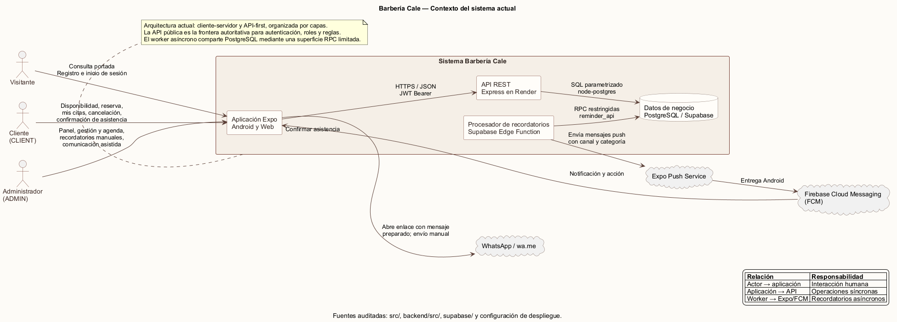

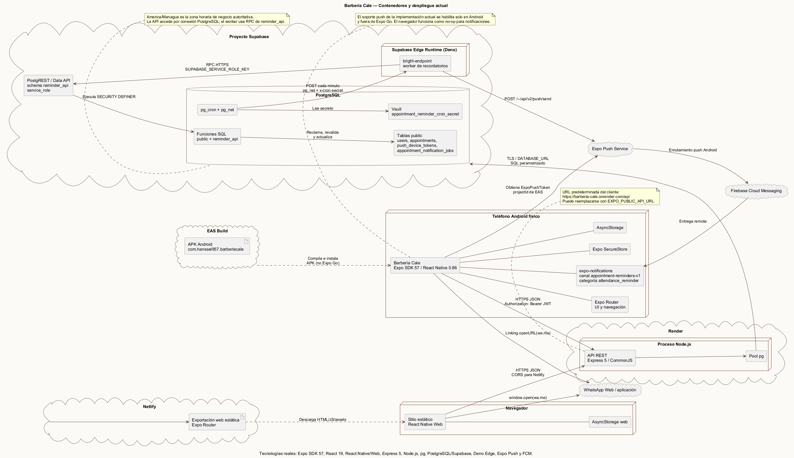

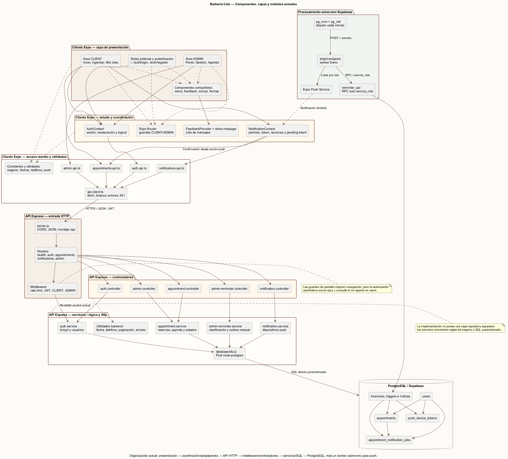

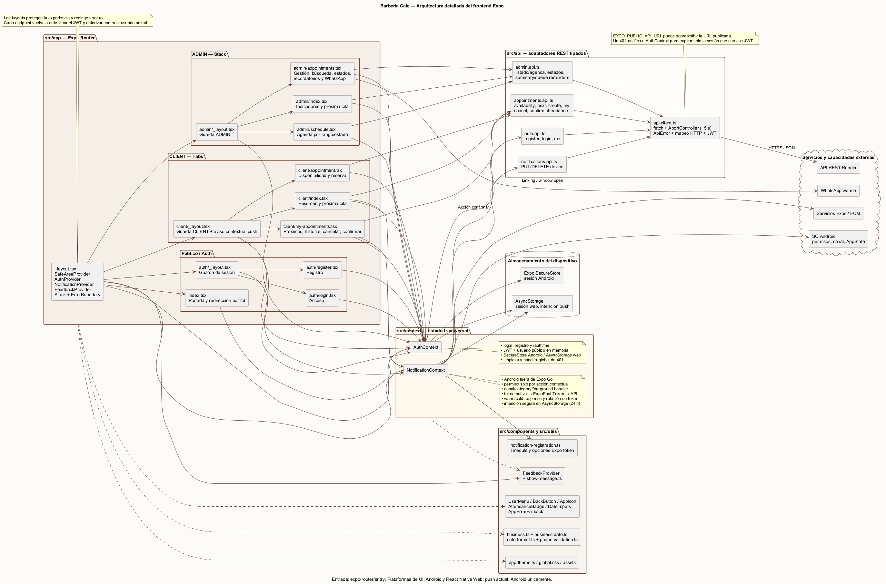

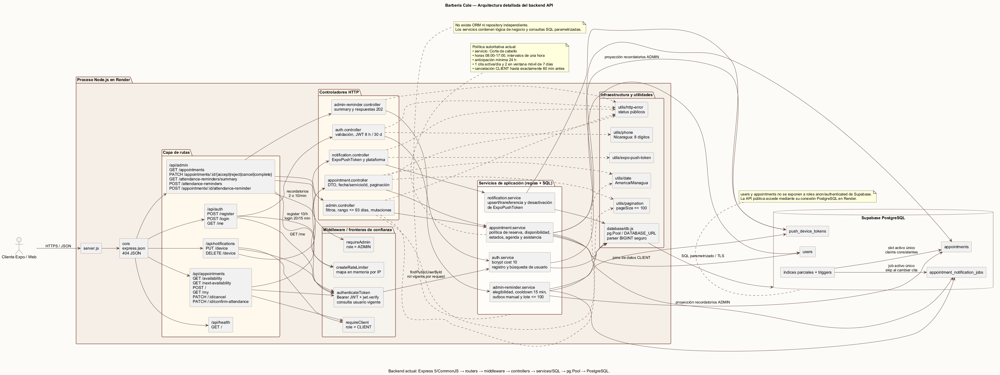

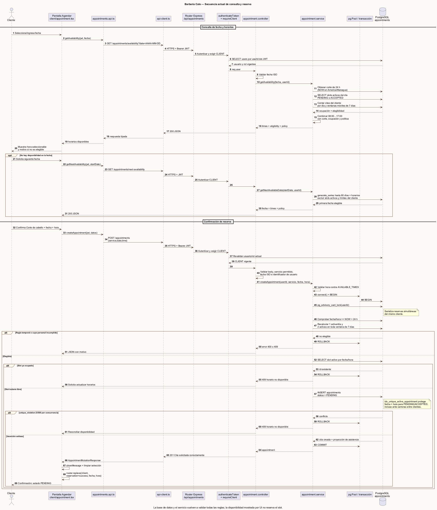

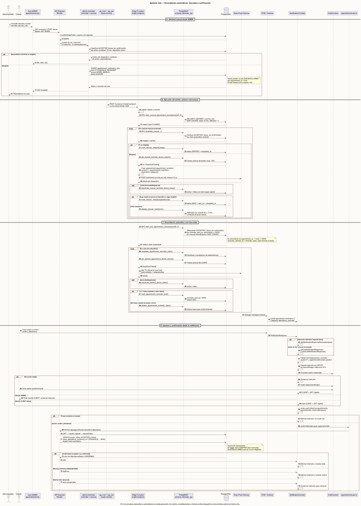

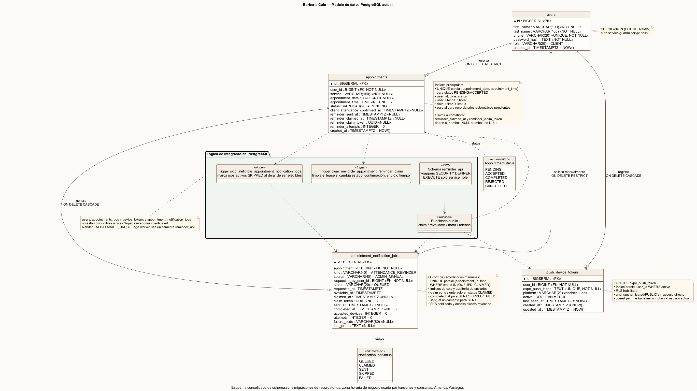

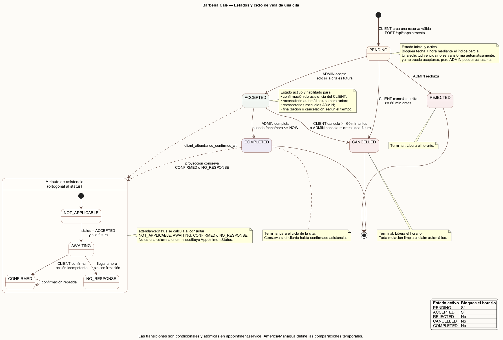

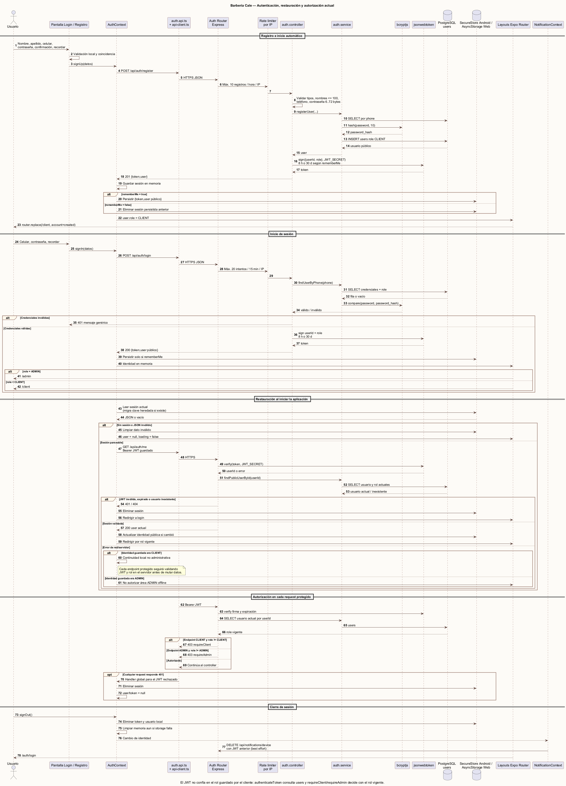

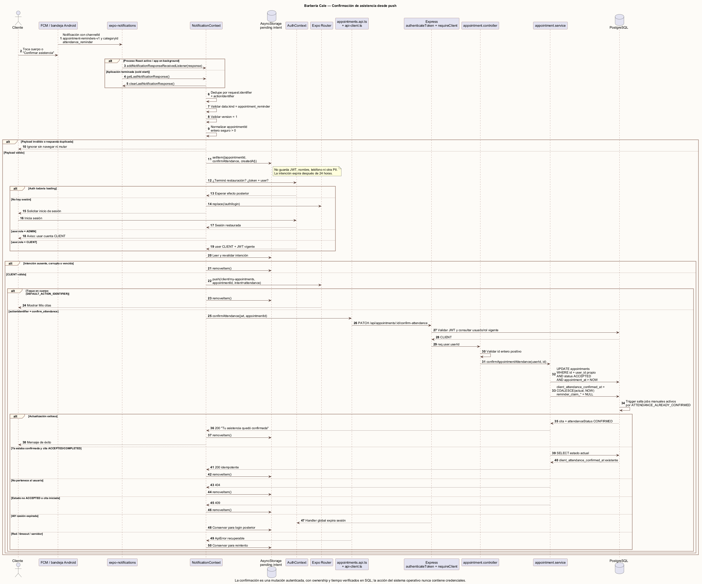

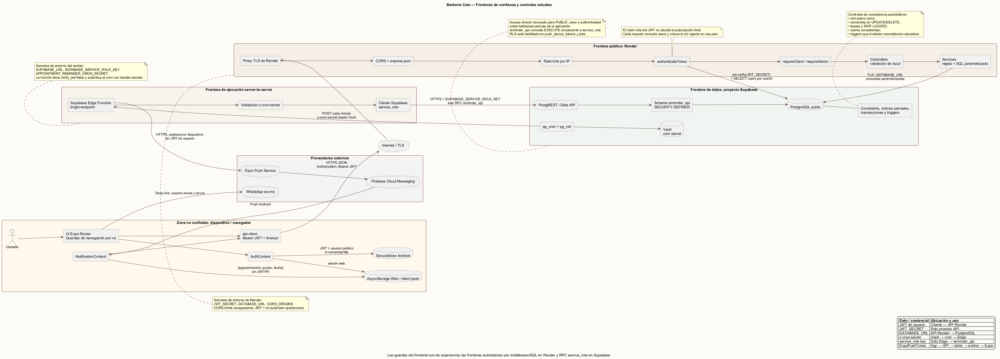

### 6.1 Lectura de la vista de contexto

El cliente y el administrador acceden al mismo producto, pero a flujos distintos según su rol. Ambos consumen la API de Barbería Cale. Solo la API pública de Render se considera entrada de negocio interactiva. La base de datos, el esquema de RPC de recordatorios y las credenciales de proveedores permanecen fuera del cliente. El planificador y el worker constituyen el segundo punto de ejecución, limitado a recordatorios.

### 6.2 Lectura de la vista de contenedores/despliegue

- **Aplicación Android:** binario nativo generado por EAS; contiene Expo Router, React Native, SecureStore y `expo-notifications`.
- **Aplicación web:** exportación estática servida por Netlify; comparte componentes y adaptadores, con sustituciones específicas para controles web.
- **API REST:** proceso Node.js/Express en Render.
- **PostgreSQL/Supabase:** fuente de verdad, restricciones, triggers, funciones y cola.
- **Planificador:** `pg_cron` ejecuta una expresión cada minuto.
- **Transporte HTTP desde base:** `pg_net` llama a la Edge Function con un secreto almacenado en Vault.
- **Worker Edge:** `bright-endpoint` reclama y procesa lotes, sin exponer acceso general a tablas.
- **Proveedor push:** Expo Push recibe mensajes; FCM entrega al paquete Android configurado.
- **WhatsApp:** integración voluntaria de salida por deep link, sin escritura automática en el sistema.

### 6.3 Flujo de dependencias

```text
Pantalla
  → contexto/componente
    → adaptador src/api
      → HTTPS /api
        → ruta Express
          → middleware de identidad/rol/límite
            → controlador
              → servicio de aplicación
                → SQL parametrizado/transacción
                  → PostgreSQL
```

Para recordatorios el flujo adicional es:

```text
pg_cron → pg_net → Edge Function → RPC reminder_api
        → Expo Push → FCM → Android
```

---

## 7. Catálogo de módulos y responsabilidades

### 7.1 Frontend Expo

| Módulo | Archivos representativos | Responsabilidad | Dependencias permitidas |
|---|---|---|---|
| Arranque y enrutamiento | `src/app/_layout.tsx`, `src/app/index.tsx`, layouts por grupo | Montar providers, resolver el destino inicial y declarar navegación. | Contextos y Expo Router. |
| Autenticación visual | `src/app/auth/login.tsx`, `register.tsx` | Capturar credenciales, validar forma, comunicar carga/error y ejecutar login/registro. | `AuthContext`, utilidades de celular y tema. |
| Área cliente | `src/app/client/index.tsx`, `appointment.tsx`, `my-appointments.tsx` | Inicio, selección de fecha/horario, reserva, próximas citas, historial, cancelación y confirmación. | API de citas, AuthContext, NotificationContext y componentes. |
| Área administrativa | `src/app/admin/index.tsx`, `appointments.tsx`, `schedule.tsx` | Resumen, gestión de solicitudes, filtros, agenda, transiciones y recordatorios. | API administrativa y componentes compartidos. |
| Estado de autenticación | `src/context/AuthContext.tsx` | Registrar, iniciar/cerrar, restaurar, validar y exponer identidad/sesión. | API de autenticación y almacenamiento de plataforma. |
| Estado de notificaciones | `src/context/NotificationContext.tsx` | Solicitar permiso, obtener token nativo y Expo, registrar/desactivar dispositivo, manejar eventos y exponer etapas de activación. | `expo-notifications`, API de dispositivos y utilidades de timeout. |
| Retroalimentación | `src/components/FeedbackProvider.tsx`, `src/utils/show-message.ts` | Mensajes globales, confirmaciones y comunicación de resultados. | React/React Native. |
| Componentes comunes | `BackButton`, `UserMenu`, `AttendanceBadge`, `AppIcon`, `WebDateInput` | Interacciones consistentes, accesibles y adaptadas a plataforma. | Tema y APIs de plataforma. |
| Adaptadores HTTP | `src/api/api-client.ts`, `auth.api.ts`, `appointments.api.ts`, `admin.api.ts`, `notifications.api.ts` | Serializar solicitudes, incluir token, tipar respuestas, normalizar error y compatibilidad de contratos. | `fetch` y tipos locales. |
| Tema y reglas de presentación | `src/constants/app-theme.ts`, `business.ts`, `global.css` | Identidad visual, espaciado, tipografía y constantes compartidas de interfaz. | Ninguna capa de servidor. |
| Fechas/validaciones | `src/utils/business-date.ts`, `date-format.ts`, `phone-validation.ts` | Formato local y validaciones inmediatas; no sustituyen las reglas autoritativas. | APIs estándar. |

### 7.2 Backend API

| Módulo | Archivos representativos | Responsabilidad |
|---|---|---|
| Composición HTTP | `backend/src/server.js` | Configurar Express, proxy, CORS, JSON, rutas y respuesta 404. |
| Rutas | `backend/src/routes/*.routes.js` | Exponer verbos/rutas y componer middleware con controlador. |
| Autenticación | `auth.controller.js`, `auth.service.js` | Validar entrada, hashear/verificar contraseña, emitir JWT y recuperar usuario. |
| Middleware de identidad | `auth.middleware.js` | Validar Bearer JWT y consultar la identidad/rol actual en base de datos. |
| Autorización | `client.middleware.js`, `admin.middleware.js` | Rechazar operaciones que no correspondan al rol actual. |
| Limitación de frecuencia | `rate-limit.middleware.js` | Limitar login, registro y recordatorios para reducir abuso accidental o deliberado. |
| Citas | `appointment.controller.js`, `appointment.service.js` | Disponibilidad, reserva, listado, cancelación, confirmación, agenda y transiciones administrativas. |
| Dispositivos push | `notification.controller.js`, `notification.service.js` | Validar tokens Expo, registrar de forma idempotente y desactivar tokens por propietario. |
| Recordatorios administrativos | `admin-reminder.controller.js`, `admin-reminder.service.js` | Resumir elegibilidad y persistir solicitudes manuales individuales o masivas. |
| Persistencia | `database/db.js`, `schema.sql`, `migrations/*.sql` | Pool PostgreSQL, esquema base, evolución, índices, triggers y RPC restringidas. |
| Utilidades | `utils/date.js`, `pagination.js`, `phone.js`, `http-error.js`, `expo-push-token.js` | Reglas técnicas compartidas y normalización de errores. |

### 7.3 Procesamiento asíncrono

| Componente | Archivo | Responsabilidad |
|---|---|---|
| Programación | `supabase/cron/schedule-appointment-reminders.sql` | Registrar o actualizar un job por minuto y llamar a la Edge Function. |
| Worker | `supabase/functions/bright-endpoint/index.ts` | Autenticar al cron, reclamar lotes, revalidar, consultar tokens, enviar a Expo y cerrar/liberar trabajos. |
| Frontera RPC | migraciones `reminder_api_boundary`, `reminder_reliability`, `manual_attendance_reminders` | Exponer al worker solo las operaciones requeridas con claims y búsqueda segura. |
| Proveedor | Expo Push/FCM | Aceptar tickets y entregar notificación remota a Android. |

---

## 8. Contratos de la API REST

### 8.1 Convenciones

- Base lógica: `/api`.
- Cuerpos y respuestas: JSON.
- Operaciones protegidas: `Authorization: Bearer <JWT>`.
- Respuestas exitosas contienen `success: true`; errores contienen `success: false` y un mensaje apto para el usuario.
- Las consultas de lista usan `page` y `pageSize`; el límite máximo actual es 100.
- Una solicitud de recordatorio aceptada para procesamiento responde como trabajo encolado, no como garantía de entrega final.

### 8.2 Endpoints públicos y de sesión

| Método y ruta | Rol | Caso de uso | Datos principales |
|---|---|---|---|
| `GET /api/health` | Público | Comprobar disponibilidad de la API. | Estado del servicio. |
| `POST /api/auth/register` | Público | Crear cliente y devolver JWT/usuario. | nombre, apellido, celular, hash, rol. |
| `POST /api/auth/login` | Público | Verificar credenciales y devolver JWT/usuario. | celular, hash, usuario. |
| `GET /api/auth/me` | Autenticado | Validar token y obtener identidad vigente. | usuario y rol actual. |

### 8.3 Endpoints de cliente

| Método y ruta | Caso de uso | Regla autoritativa |
|---|---|---|
| `GET /api/appointments/availability?date=` | Consultar horarios de una fecha. | 24 h, ocupación y elegibilidad del cliente. |
| `GET /api/appointments/next-availability?startDate=` | Encontrar la siguiente fecha utilizable. | Busca hasta 60 días y respeta límites del cliente. |
| `POST /api/appointments` | Crear cita `PENDING`. | Transacción, bloqueo por cliente, índice único parcial. |
| `GET /api/appointments/my` | Obtener citas propias paginadas. | Solo filas del usuario autenticado. |
| `PATCH /api/appointments/:id/cancel` | Cancelar cita propia. | Propiedad, estado activo y ventana inclusiva de 60 min. |
| `PATCH /api/appointments/:id/confirm-attendance` | Confirmar asistencia. | Propiedad, `ACCEPTED`, futura e idempotencia. |
| `PUT /api/notifications/device` | Registrar/reactivar dispositivo. | Token Expo válido y usuario autenticado. |
| `DELETE /api/notifications/device` | Desactivar dispositivo propio. | Token y propietario. |

### 8.4 Endpoints administrativos

| Método y ruta | Caso de uso | Regla autoritativa |
|---|---|---|
| `GET /api/admin/appointments` | Gestión o agenda con estado, búsqueda y rango. | Rol `ADMIN`, paginación y rango máximo de 93 días. |
| `PATCH /api/admin/appointments/:id/accept` | Aceptar. | Solo desde `PENDING`. |
| `PATCH /api/admin/appointments/:id/reject` | Rechazar. | Solo desde `PENDING`; libera horario. |
| `PATCH /api/admin/appointments/:id/cancel` | Cancelar administrativamente. | Solo `ACCEPTED` y futura según regla. |
| `PATCH /api/admin/appointments/:id/complete` | Completar. | Solo `ACCEPTED` cuando la hora llegó o pasó. |
| `GET /api/admin/attendance-reminders/summary` | Resumen de elegibles. | Cuenta elegibles, cola, cooldown y falta de dispositivo. |
| `POST /api/admin/attendance-reminders` | Encolar recordatorios masivos. | Hasta 100 elegibles, rate limit y exclusión concurrente. |
| `POST /api/admin/appointments/:id/attendance-reminder` | Encolar uno. | Elegibilidad, cooldown, dispositivo y no duplicación. |

### 8.5 Códigos relevantes

- `200`: consulta o mutación completada de forma síncrona.
- `201`: recurso creado cuando aplica al contrato.
- `202`: recordatorio persistido para procesamiento asíncrono.
- `400`: formato o regla temporal inválida.
- `401`: credencial ausente o inválida.
- `403`: identidad válida sin rol autorizado.
- `404`: recurso inexistente o no accesible para el propietario.
- `409`: conflicto de estado, disponibilidad, duplicidad o límite de negocio.
- `429`: límite temporal de solicitudes.
- `500`: fallo no esperado sin revelar detalles internos.

---

## 9. Diseño de datos

### 9.1 Entidades

| Tabla | Finalidad | Campos principales |
|---|---|---|
| `users` | Identidad local de clientes y administradores. | `id`, `first_name`, `last_name`, `phone`, `password_hash`, `role`, `created_at`. |
| `appointments` | Cita y su ciclo operativo, además del claim automático. | `user_id`, servicio, fecha, hora, estado, confirmación de asistencia, `reminder_sent_at`, claim/intententos y creación. |
| `push_device_tokens` | Dispositivos que un cliente autorizó para recordatorios. | `user_id`, `expo_push_token`, plataforma, activo, última vista y timestamps. |
| `appointment_notification_jobs` | Solicitud manual durable y auditable. | cita, tipo, origen, solicitante, estado, disponibilidad, claim, intentos, dispositivos aceptados y fallo. |

### 9.2 Relaciones

- Un `user` posee cero o muchas `appointments`.
- Un `user` posee cero o muchos `push_device_tokens`.
- Una `appointment` puede tener varios trabajos históricos, pero como máximo un trabajo manual activo del mismo tipo.
- Un administrador, como `requested_by_user_id`, puede solicitar muchos trabajos.
- La eliminación de un usuario está restringida si tiene citas y propaga a sus tokens; los trabajos conservan integridad con cita y solicitante según las claves definidas.

### 9.3 Integridad y concurrencia

- `phone` es único.
- `role`, estado de cita, plataforma, tipo/origen/estado de trabajo usan restricciones `CHECK`.
- El índice `idx_unique_active_appointment` es único sobre fecha y hora solo cuando el estado está en `PENDING` o `ACCEPTED`. Rechazar o cancelar libera el horario sin borrar el historial.
- La reserva ejecuta `BEGIN`, obtiene `pg_advisory_xact_lock(userId)`, vuelve a verificar anticipación/límites/disponibilidad, inserta y hace `COMMIT`. El error PostgreSQL `23505` se convierte en conflicto comprensible.
- Las columnas de claim exigen consistencia entre timestamp y token UUID.
- Un trigger limpia reclamos automáticos cuando una cita deja de ser elegible.
- Otro trigger marca trabajos manuales activos como `SKIPPED` cuando cambia el estado, el cliente confirma, la cita inicia o un recordatorio automático reciente hace redundante el trabajo.
- RLS se habilita sobre tokens y trabajos; la aplicación cliente no usa estas tablas mediante Data API.

### 9.4 Tiempo de negocio

La fecha y hora de cita se almacenan separadas porque representan una agenda local. Al compararlas con un instante se combinan y se interpretan en `America/Managua`. Esta decisión evita que la zona del navegador o del teléfono cambie el significado de las 08:00 de la barbería. Debe cambiarse de forma coordinada en backend, SQL y worker si el negocio adopta otra zona.

### 9.5 Estados de cita

```text
PENDING  → ACCEPTED → COMPLETED
    └────→ REJECTED
    └────→ CANCELLED (cliente, mientras sea elegible)
ACCEPTED └──────────→ CANCELLED (cliente o administrador, según regla)
```

Los estados finales `COMPLETED`, `REJECTED` y `CANCELLED` no vuelven a un estado activo. La confirmación del cliente se conserva como `client_attendance_confirmed_at`, no como un sexto estado, porque una cita puede ser aceptada y confirmada al mismo tiempo.

### 9.6 Proyección de asistencia

| Proyección | Interpretación |
|---|---|
| `CONFIRMED` | Existe `client_attendance_confirmed_at`. |
| `AWAITING` | Cita aceptada, futura y todavía no confirmada. |
| `NO_RESPONSE` | La cita aceptada/completada llegó o pasó sin confirmación. |
| `NOT_APPLICABLE` | Estado en el que no corresponde solicitar confirmación. |

### 9.7 Estados de trabajo manual

| Estado | Significado |
|---|---|
| `QUEUED` | Persistido y disponible, o esperando su siguiente reintento. |
| `CLAIMED` | Una ejecución posee temporalmente el trabajo mediante UUID. |
| `SENT` | Al menos un ticket fue aceptado por Expo Push. |
| `SKIPPED` | Dejó de ser elegible o no existe dispositivo activo. |
| `FAILED` | Se agotaron los intentos o ocurrió una condición terminal. |

---

## 10. Reglas de negocio autoritativas

| Regla | Aplicación técnica |
|---|---|
| Celular | Ocho dígitos, sin espacios, inicio `8`, `7` o `5`; frontend anticipa y backend confirma. |
| Anticipación | La cita debe iniciar al menos 24 horas después del reloj de negocio. |
| Horario | Bloques `08:00` a `17:00`, cada hora. |
| Bloqueo de horario | Solo `PENDING` y `ACCEPTED` ocupan un bloque. |
| Límite diario | Máximo una cita activa del mismo cliente en la fecha. |
| Límite móvil | Máximo dos citas activas en cualquiera de las ventanas de siete días que incluyen la candidata. |
| Cancelación cliente | `PENDING` o `ACCEPTED` y al menos 60 minutos restantes; comparación inclusiva. |
| Aceptación/rechazo | Únicamente desde `PENDING`. |
| Completar | Únicamente desde `ACCEPTED` cuando el inicio llegó o pasó. |
| Consulta de agenda | Rango máximo de 93 días y página máxima de 100 registros. |
| Confirmación | Propietario, `ACCEPTED`, futura y sin confirmación previa. |
| Recordatorio individual | Cita aceptada, futura, no confirmada, dispositivo activo, sin job activo ni recordatorio en los últimos 15 min. |
| Recordatorio masivo | Mismas reglas, máximo 100 inserciones por solicitud. |
| Worker | Hasta cinco recordatorios automáticos y cinco manuales reclamados por ejecución. |
| Reintentos manuales | Hasta tres intentos; espera aproximada de 30 s y luego 2 min entre reintentos. |

---

## 11. Arquitectura de notificaciones y confirmación

### 11.1 Activación del dispositivo

1. Un cliente autenticado ve una invitación para activar recordatorios.
2. Android solicita permiso mediante `expo-notifications`.
3. `NotificationContext` obtiene el token nativo del dispositivo.
4. Obtiene el token Expo pasando explícitamente ese token nativo y el `projectId` EAS.
5. `PUT /api/notifications/device` valida y hace upsert/reactivación del token asociado al usuario.
6. La interfaz informa por etapas: permiso, preparación, conexión y registro en el servidor.

La suscripción al cambio de token consume el token recibido por el evento. No vuelve a pedir un token nativo dentro del listener, porque esa recursión podría disparar indefinidamente el mismo evento. Los timeouts evitan un estado visual eterno si Android o la red no responden.

### 11.2 Recordatorio automático T−1 h

1. `pg_cron` ejecuta el job cada minuto.
2. `pg_net` llama por HTTPS a `bright-endpoint` con `x-cron-secret` obtenido de Vault.
3. La función compara el secreto sin consultar credenciales del cliente.
4. Una RPC en `reminder_api` reclama citas `ACCEPTED`, futuras, sin confirmación, sin envío anterior y cuyo inicio menos una hora ya llegó.
5. Cada fila queda asociada a un `claim_token` y aumenta intentos.
6. El worker revalida, obtiene únicamente tokens activos de ese propietario y construye un mensaje que incluye `appointmentId`.
7. Expo Push devuelve tickets por dispositivo; `DeviceNotRegistered` provoca desactivación del token.
8. Si al menos un ticket fue aceptado y la cita sigue elegible, otra RPC marca `reminder_sent_at`; en caso contrario libera el claim.

### 11.3 Recordatorio manual individual o masivo

1. El administrador consulta el resumen o pulsa la acción de una cita.
2. Render valida JWT y rol, rate limit y elegibilidad.
3. El servicio inserta uno o varios `appointment_notification_jobs` con `QUEUED`. La petición devuelve `202` porque el envío ocurrirá después.
4. En la siguiente ejecución, el mismo worker reclama trabajos disponibles.
5. El worker revalida estado, tiempo, confirmación, dispositivo, cooldown y propiedad del claim.
6. El mensaje se envía a los dispositivos de esa cita y el job termina en `SENT`, `SKIPPED`, vuelve a `QUEUED` para reintento o termina `FAILED`.

El índice parcial evita dos jobs activos del mismo tipo para la misma cita. El enfriamiento de 15 minutos evita presión repetitiva sobre el cliente y reduce duplicados entre recordatorios automáticos y manuales.

### 11.4 Confirmación desde la notificación

El payload contiene un tipo versionado y `appointmentId`. Al tocar o responder desde el flujo soportado, la app navega a “Mis citas” y ejecuta `PATCH /appointments/:id/confirm-attendance` con la sesión del propietario. El servidor no confía en el id por sí solo: exige usuario, estado y tiempo elegible. Si ya estaba confirmada, el resultado permanece coherente; la interfaz y la administración refrescan la proyección de asistencia.

### 11.5 Semántica de confiabilidad

- El claim evita procesamiento simultáneo del mismo registro.
- Los claims antiguos pueden recuperarse después de su lease.
- La elegibilidad se verifica varias veces para cerrar carreras con cancelación, rechazo o confirmación.
- `collapseId`/`tag` agrupa notificaciones de la misma cita en Android.
- La expiración del mensaje coincide con el inicio; una notificación ya inútil no debe entregarse después.
- La aceptación de un ticket Expo es una confirmación intermedia. La entrega final requeriría almacenar identificadores de ticket y consultar push receipts.

---

## 12. Seguridad y fronteras de confianza

### 12.1 Identidad y autorización

- Las contraseñas se almacenan como hash, nunca en texto plano.
- El JWT identifica la sesión; el middleware consulta el usuario y rol actuales para no depender de un rol obsoleto enviado por el cliente.
- Los layouts protegen navegación por experiencia, pero la seguridad efectiva reside en `authenticateToken`, `requireClient` y `requireAdmin`.
- Cada mutación de cliente incluye `user_id` en la condición SQL para evitar acceso horizontal a citas ajenas.
- Los endpoints administrativos exigen rol `ADMIN` en cada solicitud.

### 12.2 Base de datos y worker

- El cliente no conoce credenciales de PostgreSQL ni service role.
- La API accede a PostgreSQL desde el servidor mediante variables de entorno.
- La Edge Function usa service role solo dentro de su entorno y consume un esquema RPC estrecho, no una interfaz general de tablas.
- Las funciones `SECURITY DEFINER` fijan `search_path` seguro y sus permisos se limitan al rol requerido.
- Los roles `anon` y `authenticated` no necesitan permisos directos sobre las tablas internas de recordatorios.
- El endpoint Edge puede tener verificación JWT de plataforma desactivada porque no recibe un JWT de usuario; su autenticación específica es `x-cron-secret` y la llamada se origina desde cron/Vault.

### 12.3 Red y configuración

- Render termina TLS y Express confía en un solo proxy para recuperar IP.
- CORS permite orígenes configurados, desarrollo local y previews Netlify reconocibles.
- Los secretos esperados se inyectan en despliegue; no deben imprimirse en logs ni representarse en diagramas.
- Los límites de frecuencia protegen login, registro y envío manual, aunque la implementación actual es local a una instancia.
- Los mensajes de error públicos no exponen SQL, hashes, tokens ni detalles del proveedor.

### 12.4 Amenazas mitigadas y pendientes

| Riesgo | Control actual | Mejora futura |
|---|---|---|
| Reserva simultánea | Transacción, advisory lock e índice único parcial. | Prueba de carga y métricas de conflicto. |
| Acceso por rol incorrecto | Middleware y rol vigente desde DB. | Auditoría persistente de acciones admin. |
| Enumeración/fuerza bruta | Mensajes normalizados y rate limit. | Limitador distribuido y alertas. |
| Duplicado push | Claims, índice de job, cooldown, collapse/tag. | Idempotency key externa y recibos Expo. |
| Worker público | Secreto cron y RPC mínima. | Rotación documentada y monitoreo de 401/403. |
| Token inválido | Desactivación tras `DeviceNotRegistered`. | Limpieza programada por antigüedad. |
| Certificado DB | Conexión cifrada según configuración actual. | Evitar `rejectUnauthorized=false` cuando el entorno permita validar la cadena. |

---

## 13. Despliegue y operación

### 13.1 Topología actual

| Artefacto | Plataforma | Proceso de entrega |
|---|---|---|
| Web estática | Netlify | `expo export --platform web`; el host publica los recursos generados. |
| APK Android | Expo Application Services | Perfil `preview`, distribución interna y `buildType: apk`. |
| API Node/Express | Render | Instalación npm y ejecución de `node src/server.js` desde el backend según configuración del servicio. |
| PostgreSQL | Supabase | Esquema y migraciones SQL aplicadas en orden. |
| Worker | Supabase Edge Functions | Despliegue de `bright-endpoint`. |
| Cron | Supabase PostgreSQL | `pg_cron` + `pg_net` + Vault mediante script de programación. |
| Push | Expo Push + Firebase Cloud Messaging | `google-services.json` y plugin nativo de `expo-notifications` durante la compilación. |

### 13.2 Configuración por entorno

Sin publicar valores, las categorías necesarias son:

- URL pública de API para el frontend.
- cadena de conexión PostgreSQL y configuración TLS para Render.
- secreto de firma JWT.
- orígenes CORS autorizados.
- URL y service role de Supabase dentro de la Edge Function.
- secreto compartido de cron en Edge y Vault.
- proyecto EAS, paquete Android y configuración Firebase.
- opcionalmente credenciales de Expo necesarias para el envío del proyecto.

### 13.3 Migraciones requeridas

`schema.sql` describe buena parte del estado final, pero la reconstrucción completa del subsistema de recordatorios requiere aplicar, en orden:

1. `20260823_attendance_reminders.sql`
2. `20260823_reminder_api_boundary.sql`
3. `20260824_reminder_reliability.sql`
4. `20260825_manual_attendance_reminders.sql`

Después se habilitan `pg_net` y `pg_cron`, se crea el secreto en Vault, se despliega la Edge Function y se ejecuta `schedule-appointment-reminders.sql`. `database/init.js` prueba conectividad; no debe asumirse como un gestor de migraciones.

### 13.4 Observabilidad operativa actual

- `/api/health` comprueba que el proceso HTTP responde.
- Render presenta eventos y logs del servicio.
- Supabase muestra invocaciones y logs de la Edge Function.
- `net._http_response` permite inspeccionar el resultado de llamadas de `pg_net`.
- `cron.job`/historial asociado permite verificar que el schedule existe y se ejecuta.
- La respuesta agregada del worker informa `claimed`, `sent`, `skipped`, `retrying` y `failed`, separados entre automático y manual.
- Los trabajos manuales preservan intentos, errores y resultados por cita.

---

## 14. Matriz de trazabilidad completa

| Req. | Pantalla/interfaz | Módulo frontend | Endpoint / componente backend | Datos principales |
|---|---|---|---|---|
| RF-01 | Registro | `auth/register.tsx`, `AuthContext` | `POST /auth/register`; auth controller/service | `users`: nombre, apellido, celular, hash, rol |
| RF-02 | Login / redirección inicial | `auth/login.tsx`, `app/index.tsx`, `AuthContext` | `POST /auth/login`; auth controller/service | `users`, JWT |
| RF-03 | Arranque de aplicación | `AuthContext`, almacenamiento de plataforma | `GET /auth/me`; auth middleware/service | sesión local y `users` |
| RF-04 | Menú de usuario | `UserMenu`, `AuthContext`, `NotificationContext` | `DELETE /notifications/device` como mejor esfuerzo; limpieza local | JWT local, `push_device_tokens.active` |
| RF-05 | Agendar cita | `client/appointment.tsx` | `GET /appointments/availability`, `/next-availability`; appointment service | `appointments`, horario y política |
| RF-06 | Confirmación de reserva | `client/appointment.tsx` | `POST /appointments`; transacción e índice único | nueva fila `appointments` `PENDING` |
| RF-07 | Mis citas — Próximas | `client/my-appointments.tsx` | `GET /appointments/my` | citas `PENDING`/`ACCEPTED` |
| RF-08 | Mis citas — Historial | `client/my-appointments.tsx` | `GET /appointments/my` | citas `COMPLETED`/`REJECTED`/`CANCELLED` |
| RF-09 | Acción Cancelar cita | `client/my-appointments.tsx` | `PATCH /appointments/:id/cancel`; appointment service | estado, fecha/hora, propietario |
| RF-10 | Gestión de citas | `admin/appointments.tsx` | `GET /admin/appointments`; admin controller/service | citas, usuario, conteos y paginación |
| RF-11 | Acción Aceptar | `admin/appointments.tsx` | `PATCH /admin/appointments/:id/accept` | `appointments.status` |
| RF-12 | Acción Rechazar | `admin/appointments.tsx` | `PATCH /admin/appointments/:id/reject` | estado y liberación del índice activo |
| RF-13 | Agenda | `admin/schedule.tsx` | `GET /admin/appointments?startDate&endDate&status` | citas por rango, conteos |
| RF-14 | Acción Cancelar administrativa | `admin/appointments.tsx`, `admin/schedule.tsx` | `PATCH /admin/appointments/:id/cancel` | estado y fecha/hora |
| RF-15 | Acción Completar | vistas administrativas | `PATCH /admin/appointments/:id/complete` | estado y fecha/hora |
| RF-16 | Layouts protegidos | `_layout.tsx`, `client/_layout.tsx`, `admin/_layout.tsx` | auth/client/admin middleware | JWT y `users.role` |
| RF-17 | Acción de WhatsApp | detalle de cita administrativa | Composición local de `wa.me`; sin API de escritura | celular y mensaje contextual |
| RF-18 | Tarjeta “Recibe el recordatorio…” | `NotificationContext`, vistas cliente | `PUT/DELETE /notifications/device`; notification service | `push_device_tokens` |
| RF-19 | Notificación Android | manejador global de notificaciones | cron + Edge `bright-endpoint` + RPC | claims de `appointments`, tokens activos |
| RF-20 | “Confirmo mi asistencia” | notificación y `client/my-appointments.tsx` | `PATCH /appointments/:id/confirm-attendance` | `client_attendance_confirmed_at` |
| RF-21 | Badge/estado de asistencia | `AttendanceBadge`, vistas admin | proyección en consultas de appointment service | estado, fecha/hora, confirmación |
| RF-22 | “Enviar recordatorio” / “Recordar a todos” | `admin/appointments.tsx` | summary + POST individual/masivo; admin reminder service y worker | `appointment_notification_jobs`, tokens, cita |

### 14.1 Resultado de la trazabilidad

Cada requisito posee una interfaz o interacción identificable, una frontera técnica y una fuente de datos. No existe una pantalla independiente para el planificador porque RF-19 es un proceso automático; su representación observable está en la notificación del cliente, los estados administrativos y los registros operativos. `src/app/explore.tsx` es una ruta de compatibilidad/redirección y no representa un requisito funcional nuevo.

---

## 15. Prototipo actual y correspondencia de pantallas

| Área | Pantalla actual | Requisitos representados |
|---|---|---|
| Pública | Inicio/redirección | RF-02, RF-03, RF-16 |
| Autenticación | Iniciar sesión | RF-02, RF-03 |
| Autenticación | Crear cuenta | RF-01 |
| Cliente | Inicio | acceso a RF-05, RF-07, RF-18 |
| Cliente | Agendar cita | RF-05, RF-06 |
| Cliente | Mis citas | RF-07, RF-08, RF-09, RF-20 |
| Cliente | Activación de recordatorios | RF-18 |
| Administración | Inicio | accesos y resumen; RF-10, RF-13, RF-16 |
| Administración | Gestión de citas | RF-10, RF-11, RF-12, RF-14, RF-15, RF-17, RF-21, RF-22 |
| Administración | Agenda | RF-13, RF-14, RF-15, RF-17, RF-21 |

El prototipo implementado ya contiene las representaciones necesarias para RF-01 a RF-22. Los procesos automáticos no requieren una pantalla artificial: se documentan mediante diagramas de secuencia y se manifiestan en la notificación, la respuesta de asistencia y los indicadores administrativos. Conviene actualizar los documentos formales `alcance-v1.md` y `requisitos-v1.md` para incluir RF-18 a RF-22, pero no crear pantallas duplicadas solo para satisfacer la matriz.

---

## 16. Decisiones arquitectónicas y compromisos

| Decisión | Motivo | Beneficio | Costo o riesgo aceptado |
|---|---|---|---|
| Expo/React Native para Android y web | Equipo y alcance reducidos. | Reuso alto de UI, navegación, estado y tipos. | Ajustes por plataforma y dependencia del ecosistema Expo. |
| API REST central | Una sola autoridad para reglas y roles. | Contrato sencillo, depurable y consumible por ambas plataformas. | Requiere red y sufre el cold start de Render gratuito. |
| Monolito modular | Volumen actual no justifica servicios separados. | Despliegue, pruebas y transacciones simples. | Los módulos comparten proceso y repositorio. |
| SQL directo en servicios | Reglas temporales y consultas complejas son explícitas. | Control fino de PostgreSQL, rendimiento y transparencia. | Mayor acoplamiento a PostgreSQL y ausencia de repository/ORM formal. |
| PostgreSQL como autoridad concurrente | La disponibilidad cambia entre lectura e inserción. | Índice y transacción cierran carreras que el frontend no puede cerrar. | Solución específica de PostgreSQL (`advisory lock`, índice parcial). |
| JWT stateless | Autenticación simple entre clientes y Render. | No necesita sesión en memoria del servidor. | No existe revocación inmediata ni refresh-token formal. |
| Consultar rol vigente por solicitud | El rol puede cambiar después de emitir el token. | Autorización no depende de claims antiguos. | Una consulta adicional por petición protegida. |
| SecureStore en Android | El token es sensible. | Almacenamiento nativo más apropiado que texto plano. | Web requiere otro mecanismo y tiene un perfil de seguridad distinto. |
| Zona horaria fija de negocio | La agenda representa hora local del establecimiento. | Comparaciones consistentes entre plataformas. | Un cambio de país/zona exige ajuste coordinado. |
| Worker Edge separado de la API | El cron no debe depender de un usuario ni de una pantalla abierta. | Ejecución periódica y acceso controlado cerca de la DB. | Dos despliegues y configuración adicional. |
| RPC `reminder_api` mínima | El worker requiere privilegio sin exponer toda la Data API. | Menor superficie y operaciones atómicas de claim. | Migraciones SQL más sofisticadas y dependencia de Supabase/PostgREST. |
| Claim y revalidación | Citas pueden cambiar mientras se envía. | Reduce duplicados y envíos obsoletos. | Más estados, funciones y caminos de error. |
| Cola durable para manuales | La acción del administrador debe sobrevivir al request HTTP. | Auditoría, reintentos y estado explícito. | Conviven dos modelos: claim directo automático y job manual. |
| Expo Push + FCM | Camino gratuito y compatible con Expo/Android. | Implementación accesible y acciones de notificación. | Dependencia de proveedores y tickets no equivalentes a entrega final. |
| WhatsApp por deep link | No se requiere costo ni aprobación de API empresarial. | El administrador conserva control sobre el mensaje. | No hay envío ni trazabilidad automática dentro del sistema. |
| Rate limit en memoria | Solución proporcional a una instancia pequeña. | Bajo costo y fácil mantenimiento. | No coordina varias instancias y se reinicia con el proceso. |

### 16.1 Alternativas no seleccionadas

- **Microservicios:** aumentarían despliegues, observabilidad y consistencia distribuida sin una necesidad de escala demostrada.
- **Acceso directo de Expo a Supabase:** duplicaría reglas/seguridad en el cliente y rompería la frontera autoritativa actual.
- **Usar el estado de cita para la confirmación del cliente:** mezclaría aprobación de la barbería con intención de asistencia y produciría transiciones ambiguas.
- **Enviar push directamente desde el botón admin:** haría que el resultado dependiera de la duración del request y perdería el trabajo ante un fallo intermedio.
- **Temporizador dentro del teléfono:** no funciona si la app no está abierta, cambia de dispositivo o el sistema suspende procesos.
- **API automática de WhatsApp:** agrega costo, plantillas aprobadas y manejo de credenciales que no son necesarios para el objetivo actual.

---

## 17. Limitaciones conocidas y evolución recomendada

### 17.1 Brechas documentales/operativas

1. Los documentos formales base terminan en RF-17; deben incorporar RF-18 a RF-22.
2. Los diagramas históricos anteriores al subsistema push ya no representan toda la solución; los 12 PlantUML de esta carpeta son la vista actual.
3. `schema.sql` no reemplaza el orden de las cuatro migraciones de recordatorios.
4. No existe todavía un ejecutor automático y versionado de migraciones dentro del despliegue.
5. El README debe explicar variables por categoría, orden de migración, Data API, cron y validación de push sin incluir valores.
6. La ruta administrativa `/api/admin/test` es diagnóstica y puede retirarse en producción.
7. El script `make-admin.js` debe recibir el usuario como entrada segura, no conservar un celular fijo.

### 17.2 Limitaciones técnicas actuales

- Una solicitud `PENDING` pasada no se transforma automáticamente en un estado final; deja de bloquear por lógica temporal en algunas vistas, pero conviene definir una política explícita de expiración.
- Push remoto está orientado a Android nativo; no hay web push ni confirmación equivalente en iOS validada como parte de este alcance.
- No se procesan receipts finales de Expo, por lo que “sent” significa ticket aceptado.
- El rate limiter no es distribuido.
- La instancia gratuita de Render puede tardar en despertar.
- El patrón SQL directo exige disciplina para que controladores no absorban lógica de negocio.
- La política CORS de previews Netlify es deliberadamente amplia dentro del patrón de dominio; puede estrecharse para producción.
- La configuración actual de TLS PostgreSQL debe evolucionar hacia validación completa del certificado si el proveedor y el entorno lo permiten.

### 17.3 Ruta de evolución proporcional

1. Formalizar RF-18 a RF-22 y una guía de operación.
2. Automatizar migraciones y comprobaciones de despliegue.
3. Incorporar auditoría de acciones administrativas y métricas de jobs.
4. Procesar receipts de Expo y diferenciar “aceptado”, “entregado” y “dispositivo inválido”.
5. Mover rate limit a Redis/servicio compartido solo si se escalan instancias.
6. Agregar expiración explícita de solicitudes `PENDING`.
7. Extraer worker o módulos de la API únicamente cuando existan necesidades independientes de escala, disponibilidad o equipo.

---

## 18. Organización del repositorio y evidencia Git

### 18.1 Ubicaciones relevantes

```text
src/
  app/                 pantallas y layouts Expo Router
  api/                 adaptadores REST tipados
  components/          componentes compartidos
  context/             sesión, notificaciones y feedback
  constants/           tema y constantes
  utils/               fechas, validación y utilidades
backend/src/
  routes/              contratos HTTP
  middleware/          identidad, roles y límites
  controllers/         adaptación HTTP/casos de uso
  services/            reglas y SQL
  database/            conexión, esquema y migraciones
  utils/               utilidades del servidor
supabase/
  functions/           worker Edge
  cron/                programación del worker
proyecto/docs/
  alcance-v1.md
  requisitos-v1.md
  arquitectura-actual/
    plantuml/           fuentes de los 12 diagramas
    diagramas/          imágenes generadas
```

### 18.2 Evidencias verificables

- El historial Git identifica autor, fecha y propósito de cada cambio.
- La carpeta `backend/src/**/*.test.js` verifica controladores, middleware, servicios y utilidades críticas.
- `tests/notification-registration.test.js` protege el flujo de activación contra bloqueos y regresiones del token.
- TypeScript verifica contratos del frontend mediante `tsc --noEmit`.
- ESLint comprueba convenciones y errores estáticos.
- La exportación Expo comprueba que el bundle se genera para la plataforma objetivo.
- Los `.puml` permiten regenerar diagramas y revisar cambios arquitectónicos como texto versionable.

Comandos de verificación representativos:

```powershell
npm run lint
npx tsc --noEmit
npm run test:notifications
Push-Location backend
npm test
Pop-Location
```

La evidencia Git no debe incluir `.env`, claves de Firebase Admin, claves privadas, JWT secrets, service role ni el valor de `x-cron-secret`.

---

## 19. Reproducción de los diagramas PlantUML

### 19.1 Validar sintaxis

Desde la raíz del repositorio, suponiendo que `plantuml.jar` está disponible en una ruta local:

```powershell
java -jar "C:\ruta\plantuml.jar" `
  -charset UTF-8 `
  -checkonly `
  "proyecto\docs\arquitectura-actual\plantuml\*.puml"
```

### 19.2 Generar PNG para el documento

```powershell
java -DPLANTUML_LIMIT_SIZE=8192 `
  -jar "C:\ruta\plantuml.jar" `
  -charset UTF-8 `
  -tpng `
  -o "..\diagramas" `
  "proyecto\docs\arquitectura-actual\plantuml\*.puml"
```

### 19.3 Generar SVG editable/escalable

```powershell
java -DPLANTUML_LIMIT_SIZE=8192 `
  -jar "C:\ruta\plantuml.jar" `
  -charset UTF-8 `
  -tsvg `
  -o "..\diagramas-svg" `
  "proyecto\docs\arquitectura-actual\plantuml\*.puml"
```

PlantUML interpreta `-o` con relación a la carpeta de cada fuente. Por eso `..\diagramas` ubica las imágenes junto a la carpeta `plantuml`, dentro de `arquitectura-actual`.

---

## 20. Justificación sintética solicitada por la actividad

El proyecto utiliza inicialmente una arquitectura cliente-servidor, por capas y organizada como monolito modular, con diseño basado en una API REST. Es adecuada porque Android y web comparten casos de uso, mientras las reglas de citas, seguridad y concurrencia necesitan una autoridad central. Expo/React Native se responsabiliza de la presentación y el estado de interacción; sus módulos `src/api` adaptan el contrato HTTP. Express recibe solicitudes, autentica, autoriza y delega; los servicios concentran las reglas y PostgreSQL mantiene datos, restricciones y transacciones. Los recordatorios se separan del tráfico interactivo mediante cron, una Edge Function y RPC limitadas. Así, cada requisito puede localizarse en una pantalla, un endpoint, un módulo y un conjunto de datos, sin asumir componentes que no existen ni introducir complejidad operativa prematura.

---

## 21. Reflexión final

**¿Podemos identificar claramente qué componente de la arquitectura será responsable de implementar cada requisito?**

Sí. La matriz de trazabilidad conecta los 22 requisitos vigentes con una interfaz, un adaptador, una operación del backend y sus datos. La arquitectura también distingue los requisitos interactivos de los procesos automáticos: una reserva termina en PostgreSQL mediante la API; una notificación se procesa mediante cron/worker; una confirmación regresa por la API con la identidad del cliente. Esta separación reduce ambigüedad y permite comprobar si un cambio pertenece a presentación, coordinación, dominio, persistencia o integración externa.

La principal acción documental pendiente es promover RF-18 a RF-22 a los archivos formales de alcance y requisitos. Técnicamente, esos requisitos ya poseen representación en la interfaz y responsabilidad explícita. La arquitectura actual es suficiente para el tamaño y contexto del proyecto: preserva integridad y seguridad sin la carga de una plataforma distribuida innecesaria, y deja puntos de evolución claros para migraciones, telemetría, receipts de push y escalamiento futuro.

---

## Apéndice A. Glosario

| Término | Definición en este proyecto |
|---|---|
| Cita activa | Cita en `PENDING` o `ACCEPTED`. |
| Confirmación de la barbería | Transición de `PENDING` a `ACCEPTED`. |
| Confirmación de asistencia | Timestamp registrado por el cliente sobre una cita aceptada; no es un estado de cita. |
| Claim | Lease temporal identificado por UUID que concede a un worker el derecho a procesar una fila. |
| Cooldown | Ventana de 15 minutos que evita un nuevo recordatorio manual redundante. |
| Data API | Exposición HTTP de PostgreSQL mediante Supabase/PostgREST; no es utilizada directamente por la app cliente para datos de negocio. |
| Edge Function | Función Deno desplegada en Supabase para procesar recordatorios. |
| Expo Push token | Dirección lógica asociada a una instalación y proyecto Expo, almacenada en `push_device_tokens`. |
| FCM | Firebase Cloud Messaging, transporte nativo utilizado para Android. |
| Fuente de verdad | Componente autoritativo; para usuarios/citas/trabajos es PostgreSQL. |
| Idempotencia | Propiedad por la que repetir una intención válida no crea efectos duplicados incompatibles. |
| Job | Registro durable de un recordatorio administrativo manual. |
| Proyección de asistencia | Etiqueta calculada a partir de estado, tiempo y timestamp de confirmación. |
| RPC | Función PostgreSQL invocada de forma remota por la Edge Function bajo permisos limitados. |

## Apéndice B. Criterio de actualización del documento

Este documento debe revisarse cuando cambie cualquiera de los siguientes elementos: estado o regla de una cita, frontera de autenticación, entidad persistida, endpoint público, proveedor de despliegue, mecanismo del worker o integración push. Un cambio exclusivamente visual puede documentarse en el prototipo; un cambio que altere responsabilidades o flujo de datos debe actualizar también la matriz y el diagrama correspondiente.
